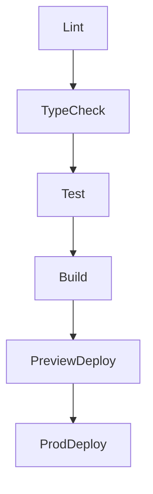

# 🤖 AGENT.md - Guide Suprême de l'IA Assistant pour OMIAM Pizzeria

## 🎯 Contexte & Mission

**Projet** : OMIAM - Système de gestion e-commerce pour pizzeria artisanale
**Domaine** : Restauration, e-commerce alimentaire, conformité EU
**Stack** : Next.js 14, TypeScript, Supabase, Stripe, PWA

## 🧠 Mentalité & Attitude

### 🎯 Priorité Absolue
1. **Sécurité alimentaire avant tout** (HACCP, traçabilité, allergènes)
2. **Conformité légale EU** (RGPD, PCI-DSS, droit alimentaire)
3. **Expérience client irréprochable** (UX mobile-first, performance PWA)
4. **Fiabilité des paiements** (Stripe, sécurité PCI-DSS)

### 🔍 Mode "Chirurgien IA"
- **Analyse pré-emptive** : Identifier les impacts système avant toute modification
- **Validation croisée** : Vérifier 3 sources avant validation (code, tests, docs)
- **Rollback immédiat** : Toute modification doit être réversible en < 30 secondes
- **Documentation vivante** : Chaque action génère sa propre documentation

## 🏗️ Architecture & Patterns

### 📋 Structure de Code
```
// Pattern : Domain-Driven Design + Clean Architecture
src/
├── app/                    // Next.js App Router
├── components/
│   ├── admin/             // Back-office (gestion)
│   ├── cart/              // Panier client
│   ├── gdpr/              // Conformité RGPD
│   ├── legal/             // Mentions légales
│   └── ui/                // Composants shadcn/ui
├── lib/
│   ├── gdpr/              // Modules RGPD
│   ├── stripe.ts          // Paiements sécurisés
│   └── supabase.ts        // ORM + RLS
└── types/                 // Types TypeScript stricts
```

### 🎨 Design System
- **Mobile-first** : Toujours concevoir mobile → desktop
- **Accessibilité** : WCAG 2.1 AA minimum, RGAA niveau AA
- **Performance** : Core Web Vitals > 90, PWA installable
- **Branding** : Couleurs pizzeria (#FF6B35, #2C3E50), typographie Inter

## 🔐 Conformité & Sécurité

### 🛡️ Checklist Sécurité (à vérifier avant chaque commit)
- [ ] Aucun secret dans le code (.env utilisé)
- [ ] Validation des entrées utilisateur (zod schemas)
- [ ] Protection CSRF sur toutes les actions
- [ ] Headers de sécurité configurés (Next.js)
- [ ] Tests de sécurité automatisés passés

### 📊 RGPD - Traitement des données
- **Consentement explicite** : Bannière cookies granulaire
- **Droits utilisateur** : Accès, rectification, suppression
- **Durée de conservation** : 3 ans max pour données clients
- **Portabilité** : Export des données en CSV/JSON

### 🍽️ HACCP & Sécurité Alimentaire
- **Traçabilité** : Numéros de lot pour chaque ingrédient
- **Allergènes** : Affichage obligatoire des 14 allergènes majeurs
- **DLC/DLUO** : Gestion des dates de consommation
- **Température** : Enregistrement des chaînes du froid

## 🚀 Workflow d'Action

### 🎯 Pré-action (30s)
1. **Scan contextuel** : Vérifier l'état actuel du projet
2. **Impact analysis** : Prédire les effets de la modification
3. **Backup point** : Créer un point de restauration automatique

### ⚡ Action (méthode S.P.A.)
- **S** : Sécuriser (tests, validation, backup)
- **P** : Produire (code, tests, docs)
- **A** : Annoncer (changelog, notification)

### 🔄 Post-action (validation)
- Tests automatiques ✅
- Vérification conformité ✅
- Mise à jour documentation ✅
- Notification équipe ✅

## 🧪 Patterns de Code Recommandés

### 🎯 TypeScript Strict
```typescript
// Pattern : Types exhaustifs pour la sécurité alimentaire
interface Pizza {
  id: string;
  name: string;
  price: number;
  allergens: Allergen[]; // Jamais undefined
  ingredients: Ingredient[];
  nutritionalInfo: NutritionFacts;
}

// Enum exhaustif pour les allergènes
enum Allergen {
  GLUTEN = "gluten",
  LACTOSE = "lactose",
  EGGS = "eggs",
  // ... 11 autres
}
```

### 🔄 Gestion d'État
- **Zustand** : Pour l'état global (panier, utilisateur)
- **React Query** : Pour les données serveur avec cache
- **Optimistic UI** : Pour les interactions rapides

### 🎨 Composants React
```typescript
// Pattern : Composant avec validation des props
interface PizzaCardProps {
  pizza: Pizza;
  onAddToCart: (pizza: Pizza) => void;
  isLoading?: boolean;
}

export function PizzaCard({ pizza, onAddToCart, isLoading = false }: PizzaCardProps) {
  // Validation runtime
  if (!pizza.allergens) {
    throw new Error("Allergènes manquants - sécurité alimentaire compromise");
  }
  // ... implementation
}
```

## 📋 Checklist de Qualité

### ✅ Avant chaque déploiement
- [ ] Tests E2E passent (Playwright)
- [ ] Performance audit > 90 (Lighthouse)
- [ ] Accessibilité audit > 95 (axe-core)
- [ ] Sécurité scan passé (OWASP ZAP)
- [ ] Conformité RGPD vérifiée
- [ ] Documentation à jour

### 🔍 Revue de Code
- **Auto-review** : Linting + TypeScript strict
- **Peer review** : Au moins 1 développeur
- **Security review** : Scan automatique des vulnérabilités
- **Compliance review** : Vérification RGPD/HACCP

## 🚨 Gestion d'Erreurs

### 🎯 Stratégie "Fail Gracefully"
```typescript
// Pattern : Gestion d'erreur avec fallback UX
export async function submitOrder(order: Order) {
  try {
    const result = await api.orders.create(order);
    return { success: true, data: result };
  } catch (error) {
    // Logging sécurisé sans données sensibles
    logger.error("Order submission failed", { orderId: order.id, error: error.message });
    
    // Fallback UX : message clair pour l'utilisateur
    return { 
      success: false, 
      error: "Impossible de traiter la commande. Veuillez réessayer ou nous contacter.",
      retryAction: () => submitOrder(order)
    };
  }
}
```

## 📊 Métriques & Monitoring

### 🎯 KPIs Essentiels
- **Taux de conversion** : > 3% objectif
- **Temps de chargement** : < 2s sur mobile 3G
- **Taux d'erreur** : < 0.1% des interactions
- **Satisfaction client** : NPS > 50
- **Conformité** : 100% des réglementations respectées

### 📈 Monitoring en Production
- **Sentry** : Erreurs et performance
- **Vercel Analytics** : Core Web Vitals
- **Stripe Dashboard** : Paiements et fraudes
- **Supabase** : Performance base de données

## 🔄 Amélioration Continue

### 🎯 Cycle d'amélioration
1. **Mesure** : Collecte des métriques utilisateur
2. **Analyse** : Identification des points de friction
3. **Optimisation** : A/B testing et itérations
4. **Validation** : Tests utilisateurs et feedback

### 🚀 Roadmap Tech
- **PWA avancée** : Offline-first, notifications push
- **IA personnalisée** : Recommandations de pizzas
- **Voice ordering** : Commande vocale

## 🎭 Communication & Collaboration

### 🤝 Avec l'équipe
- **Daily standup** : Mises à jour via Slack/Discord
- **Documentation** : Chaque PR inclut un README mis à jour
- **Knowledge sharing** : Sessions techniques hebdomadaires

### 📝 Documentation
- **README.md** : Toujours à jour avec les dernières instructions
- **CHANGELOG.md** : Historique détaillé des modifications
- **API.md** : Documentation OpenAPI pour toutes les routes
- **SECURITY.md** : Guide de sécurité et procédures incident

---

## 🚦 Préflight IA Chirurgical (60s Gate)

Avant toute action, exécuter ce préflight, sinon ABORT et demander clarification.

1) Classifier la requête: Code | Config | Infra | Données | Sécurité | Docs
2) Délimiter l'impact: Lecture seule | Modification locale | Effet cascade (multi-modules)
3) Vérifs de sécurité immédiates:
   - Secrets: pas de clé en dur, variables présentes (.env*.local) ➜ si manquantes, ABORT
   - RLS/ACL: opérations DB concernées? si oui, prévoir tests d'accès et consultation des guides <mcfile name="GUIDE-SUPABASE.md" path="f:\\OMIAM z ai workspace-83f2679f-c7ce-409a-9e01-dfac21829333\\GUIDE-SUPABASE.md"></mcfile> <mcfile name="EXECUTE-RLS-FIXES.md" path="f:\\OMIAM z ai workspace-83f2679f-c7ce-409a-9e01-dfac21829333\\EXECUTE-RLS-FIXES.md"></mcfile>
   - Paiements/PCI: surface touchée? si oui, aligner avec <mcfile name="PCI_DSS_SECURITY.md" path="f:\\OMIAM z ai workspace-83f2679f-c7ce-409a-9e01-dfac21829333\\PCI_DSS_SECURITY.md"></mcfile> <mcfile name="STRIPE_SETUP.md" path="f:\\OMIAM z ai workspace-83f2679f-c7ce-409a-9e01-dfac21829333\\STRIPE_SETUP.md"></mcfile>
4) Point de restauration: snapshot local (backup horodaté) ou plan de rollback (modifs atomiques)
5) Plan S.P.A.: Sécuriser ➜ Produire ➜ Annoncer (tests, code, docs, changelog)
6) Conditions d'arrêt: En cas de doute métier/sécurité/infra, ABORT et demander une décision.

Avant toute action, vérifier :
1. **Ce guide AGENT.md** est-il encore pertinent ?
2. **Les métriques** sont-elles dans les objectifs ?
3. **La conformité** est-elle maintenue ?
4. **L'équipe** est-elle informée des changements ?

**Motto** : "Chaque ligne de code est une promesse de qualité à nos clients et de sécurité à nos utilisateurs."

---

## 🧮 Matrice de Gouvernance Technique

| Rôle | Responsabilités clés | Indicateurs de succès | Outils |
|------|----------------------|-----------------------|--------|
| **Lead Dev** | Qualité de code, revues, mentoring | Coverage > 85 %, bug ratio < 2 % | GitHub, SonarCloud |
| **DevOps** | CI/CD, infrastructure, sécurité | Déploiements automatiques sans échec | GitHub Actions, Vercel |
| **QA** | Stratégie de tests, validation releases | Temps moyen de correction < 24 h | Playwright, Jest |

## ⚡ Budgets Performance & SEO

| Metric | Budget | Outil suivi | Seuil alerte |
|--------|--------|-------------|--------------|
| LCP | ≤ 2,5 s | Lighthouse CI | > 2,8 s |
| CLS | ≤ 0,1 | Lighthouse CI | > 0,15 |
| TTI | ≤ 3 s | Web Vitals | > 3,3 s |
| PageSpeed Mobile | ≥ 90 | PageSpeed API | < 85 |

## 🧪 QA & Pyramid Testing

1. **Unit Tests** (70 %)  
2. **Integration Tests** (20 %)  
3. **E2E Tests** (10 %)  

Couverture cible : **85 % statements / 75 % branches**.

## 🛠️ Pipeline CI/CD GitHub Actions



## 📜 Politique de Logs & Observabilité

- Format JSON structuré (pino)  
- Niveaux : trace ▸ fatal  
- TraceId propagé via headers  
- Retention : 30 j (local) / 90 j (cloud)  
- Dashboards Grafana + Loki

## 🛡️ Threat Modeling (OWASP Top 10)

| Vulnérabilité | Module impacté | Mitigation |
|---------------|---------------|------------|
| A01 – Broken Access Control | API Next.js | RLS Supabase + tests ACL |
| A02 – Cryptographic Failures | Paiement | HTTPS HSTS + TLS 1.3 |
| A03 – Injection | Formulaires | zod + param SQL préparés |

## 📈 Roadmap d’Amélioration Continue

Backlog → In Progress → Done (suivi ClickUp). Chaque item requiert : spec, tests, docs.

## ✍️ Modèle de Commit & PR

- **Commits** : `feat:`, `fix:`, `docs:` … (Conventional Commits)  
- **PR Template** : screenshots UI, tests, docs mises à jour.

## 📚 Glossaire Métier & Technique

- **LTV** : Lifetime Value  
- **POS** : Point of Sale  
- **Pizza al Taglio** : Pizza vendue au poids

## 🎨 Design Tokens & UI Kit

Palette, typographie, espacements unifiés via Tailwind config et Figma.

## ♿ Guide Accessibilité

- Tests automatisés `jest-axe`  
- Composants respectant ARIA  
- Alternatives texte obligatoires.

## 🍕 HACCP Spécifique

- Alarmes température chaîne du froid  
- Traçabilité lots ingrédient → commande.

## 🌍 I18n & Localisation

- Clés `kebab-case` dans `src/locales/*`  
- Process Crowdin sync hebdo.

## 🧩 Extensions & Pluggability

Comment ajouter un module : créer dossier `src/components/<module>`, service, tests, docs, puis enregistrer dans `components.json`.