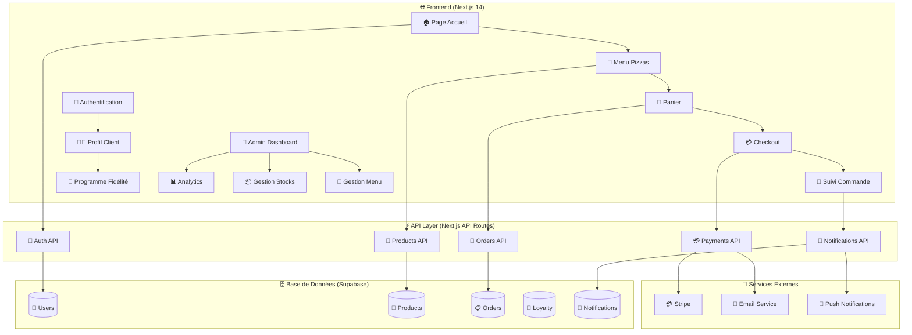
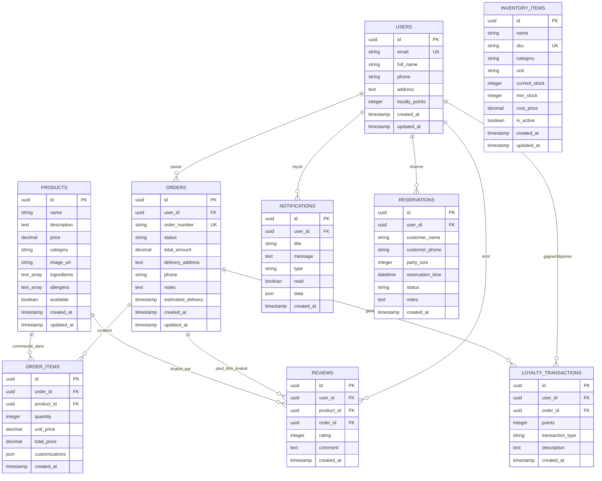
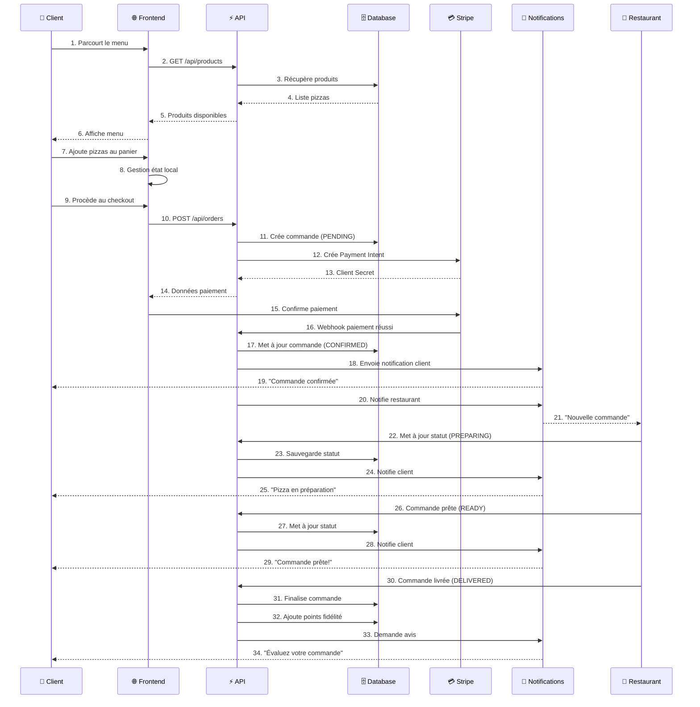
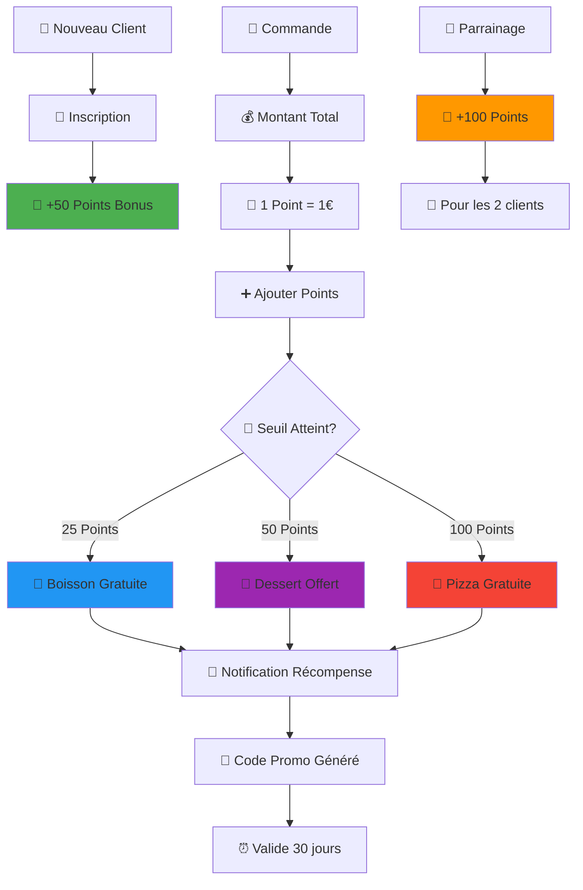
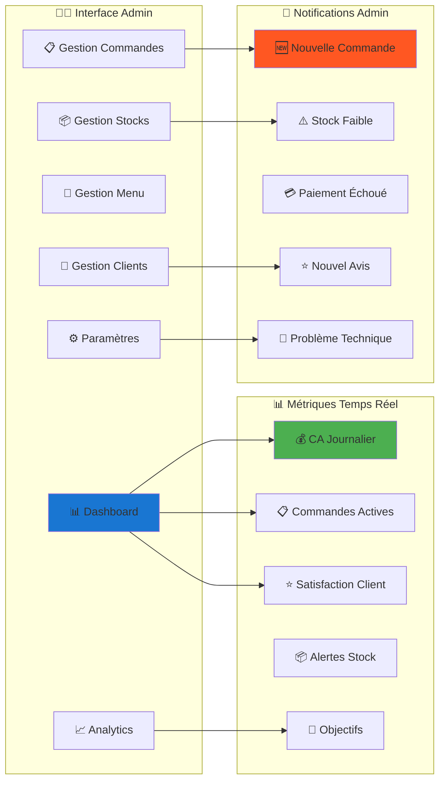
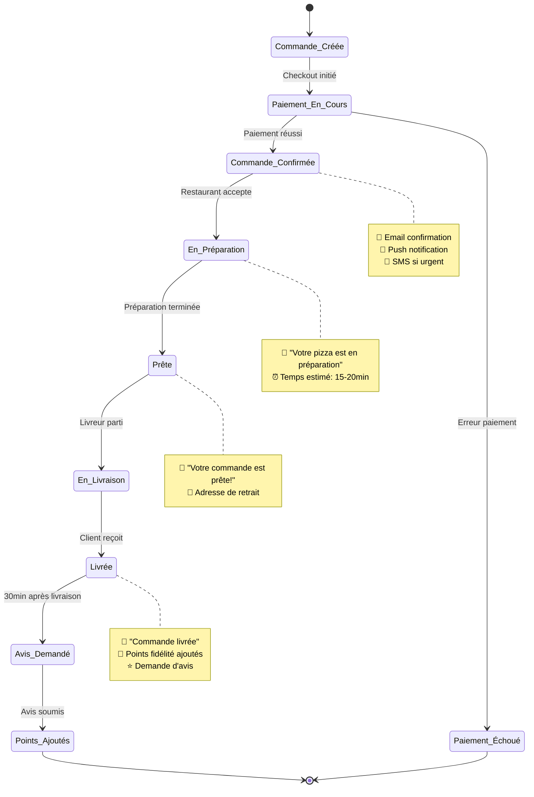
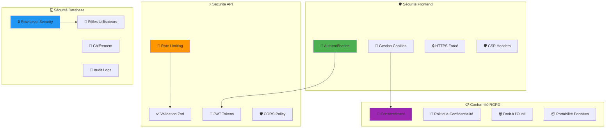
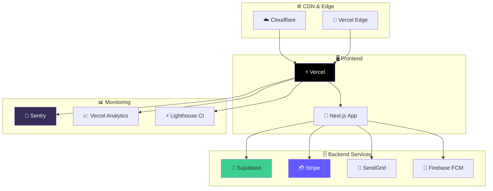
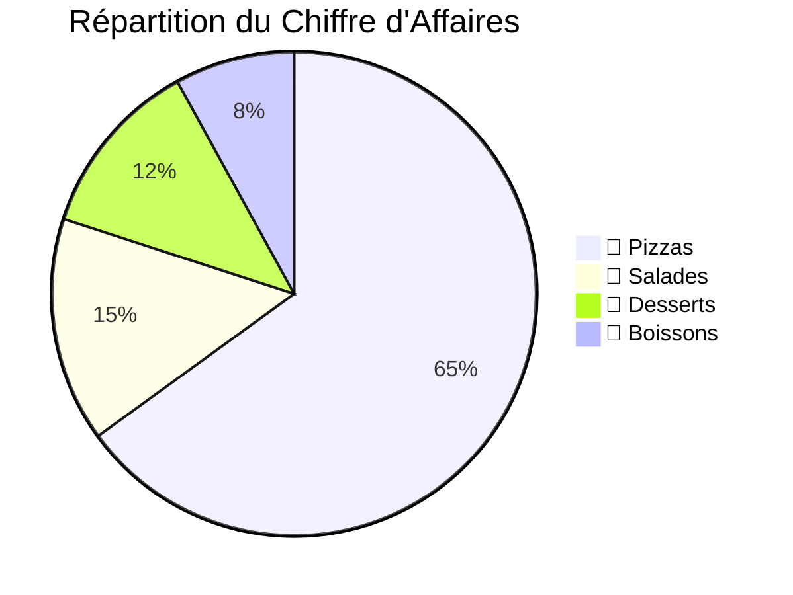
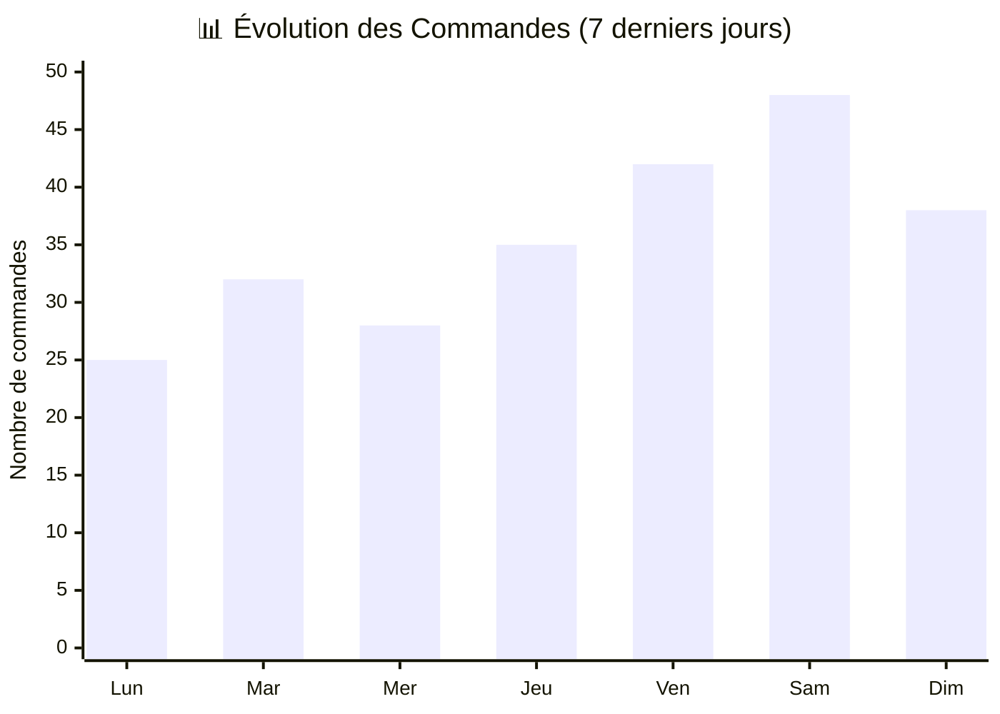

# 🏗️ ARCHITECTURE VISUELLE - O'MIAM PIZZERIA
*Diagrammes et Schémas du Système Complet*

---

## 🎯 VUE D'ENSEMBLE SYSTÈME

---

## 🍕 MODÈLE DE DONNÉES PIZZERIA

---

## 🔄 FLUX DE COMMANDE

---

## 🎁 SYSTÈME DE FIDÉLITÉ

---

## 🔧 ARCHITECTURE ADMIN

---

## 📱 NOTIFICATIONS SYSTÈME

---

## 🔒 SÉCURITÉ ET CONFORMITÉ

---

## 🚀 DÉPLOIEMENT ET INFRASTRUCTURE

---

## 📈 MÉTRIQUES ET KPI

---

## 🎯 CONCLUSION ARCHITECTURE

### ✅ **Points Forts de l'Architecture**

1. **🏗️ Scalabilité** - Architecture microservices prête pour la croissance
2. **🔒 Sécurité** - Sécurité multi-niveaux avec RLS et validation
3. **⚡ Performance** - Optimisations Next.js et caching intelligent
4. **📱 Temps Réel** - Notifications et mises à jour instantanées
5. **🔧 Maintenabilité** - Code structuré et documenté

### 🚀 **Prêt pour Production**

Cette architecture représente un **système complet et robuste** pour une pizzeria moderne, intégrant toutes les fonctionnalités nécessaires pour une expérience client exceptionnelle et une gestion efficace du restaurant.

---

*Architecture conçue pour O'Miam Pizzeria Guingamp* 🍕🏗️